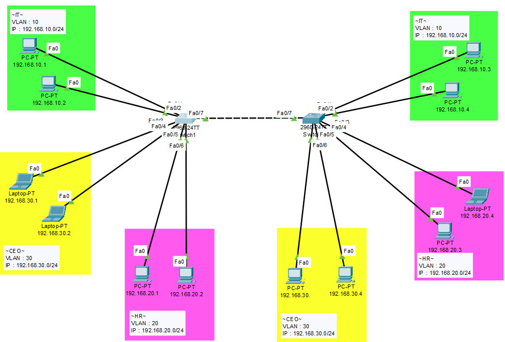
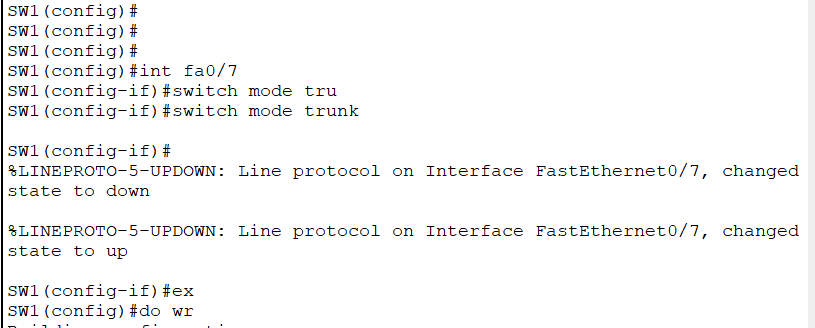
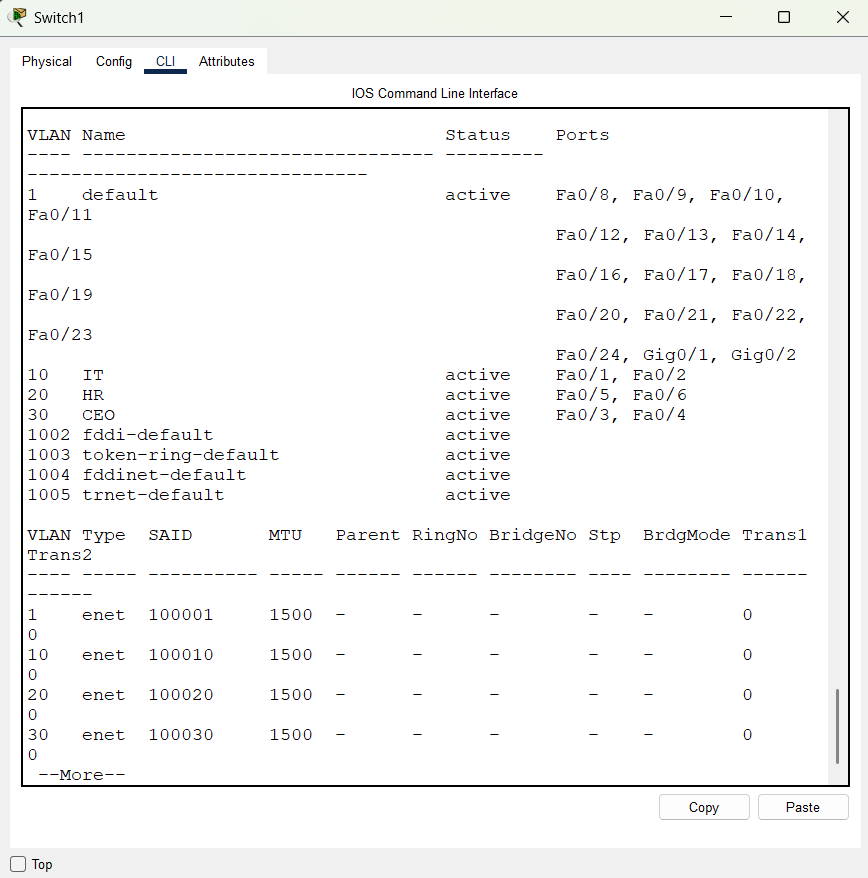
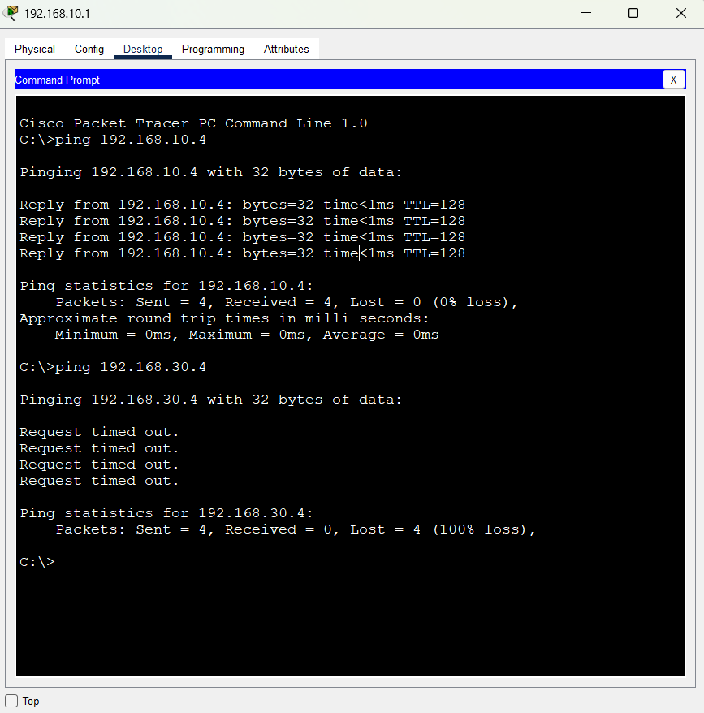

# 🌐 VLAN Configuration Lab

A practical network lab focused on designing and configuring Virtual Local Area Networks (VLANs) using a Cisco Switch. The project demonstrates network segmentation, traffic isolation, and switchport configuration to enhance local network security and performance.

---

## 🚀 Project Overview
This repository contains a complete Cisco Packet Tracer simulation designed to showcase **Layer 2 Network Segmentation**. By dividing a single broadcast domain into multiple VLANs, this setup optimizes broadcast traffic and adds an essential layer of security to the local network infrastructure.

### 🔑 Key Features
* **Network Segmentation:** Dividing the local network into logical groups (VLANs) to isolate traffic.
* **Trunking & Access Ports:** Configuring specific switchports for end-user devices and setting up Trunk links for carrying multiple VLANs.
* **Security & Isolation:** Preventing unauthorized communication between different network segments at the Switch level.
* **Connectivity Testing:** Validating network behavior using Ping tests to confirm isolation.

---

## 📸 Lab Visuals & Screenshots

### 1️⃣ Network Topology Diagram
The blueprint of the local network area setup showing device distribution across logical segments.

### 2️⃣ Switch Configuration & Trunking
CLI configurations showing how the switchports were assigned, named, and how Trunk mode was established.

### 3️⃣ VLAN Verification Table
The active VLAN database table ensuring all interfaces are bound to their correct respective VLAN IDs.

### 4️⃣ Connectivity & Security Testing
Ping test execution demonstrating successful packet delivery within the same VLAN and secure isolation between different VLANs.

---

## 🛠️ Tools & Technologies Used
* **Cisco Packet Tracer** - Network simulation and visualization environment.
* **Cisco IOS** - Command Line Interface (CLI) configuration.

---

## 📂 How to Run the Lab
1. Download and install **Cisco Packet Tracer**.
2. Clone this repository or download the `VLAN Configuration Lab.pkt` file.
3. Open the `.pkt` file inside Packet Tracer to inspect the configuration or simulate traffic.
